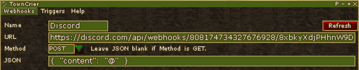

TODO: Show how to use varialbes in messages to set Discord name

# TownCrier

A [Decal](https://www.decaldev.com/) plugin that can send [Webhooks](https://en.wikipedia.org/wiki/Webhook) in response to ingame events.

_TownCrier cannot be used to send info into AC such as sending Discord messages into fellowship chat.
I think the idea is interesting but I'd probably start another plugin to build this because of how different it is from how TownCrier is built._

## Features

- Supports both `GET` and `POST` webhooks with arbitrary query parameters and/or `JSON` payloads
- Payloads can send extra info such as your character's name, level, unassigned XP, and more. See [Variables](#Variables)
- Can trigger webhooks based upon:
  - Common ingame events (death, leveling, etc.)
  - Timed intervals
  - Chat box messages (includes player chat as well as other messages)
- Per-character and shared profiles for triggers (Webhooks are shared by default)
- A minimal command line interface (See `@tc` ingame)

## Installation

Download the latest [release](https://github.com/amoeba/TownCrier/releases) installer and run it.

## Getting started

To get started using TownCrier, you need to:

2. Create at least one Webhook
3. Create at least one Trigger (Event, Timed, or Chat)

### Creating a Webhook

I expect most people using TownCrier probably want to use TownCrier with Discord so below are instructions for doing that:

1. Get a webhook URL from Discord
  - Pick a channel on guild/server you're admin on
  - Right-click on the channel and select **⚙ Edit Channel**
  - Select **Integrations**
  - Select **Webhooks**
  - Click **CreateWebhook** (or **New Webhook** if you already have one set)
  - Optionally, change your webhook's name and channel if you want
  - Click **Copy Webhook URL** to get your webhook URL
2. Create a new TownCrier Webhook using the URL from the previous step
  - Go ingame town TownCrier installed and enabled in Decal
  - Give your Webhook a name. This must be unique.
  - Paste the URL you copied in the previous step into the URL field
  - Change Method to `POST`
  - Enter `{ "content": "@" }` in the JSON field. This is specific to Discord.

    Your screen should look something like this:
  
    
  - Click **Add Webhook**

Note: The `@` symbol in the JSON payload field is a special symbol.
When TownCrier triggers your Webhook, the `@` symbol is replaced by whatever [Message](#Message) or event triggered it.
If you set the JSON field in the above examples to `{ "content": "Hi" }`, all your Webhook would ever do is send the text "Hi" to your Discord channel.

### Creating a Trigger

Triggers are what cause Webhooks to be sent so your newly-created Webhook won't do anything without setting at least one Trigger up.
There are three types of Triggers:

1. Event: Send Webhooks when certain events happen ingame (e.g., you dying)
2. Timer: Send Webhooks at timed intervals
3. Chat: Send Webhooks when you see certain text in chat (doesn't have to be actual chat, just messages in the chat window). What you enter for the Pattern is treated as a Regular Expression by default and supports [Variables](#Variables). When Variables are used, the value is replaced before the regular expression is tested.

The trickiest part of setting up a trigger is using the [Message](#Message) field.

## Message

The Message field is optional and gives you a way to customize what's sent to your webhook target.
If left blank, a message corresponding to the event that triggered your Webhook will be sent.
For example, if your character's name is "Asheron" and you have an Event Trigger for "You log in", when you log in, you're webhook target will be sent the message "Asheron has logged in".
If, instead, you set the Message field to "Hey, I logged in", you'd get that message instead.

## Variables

In the Message field, you can make use of special variables to send information about your character and the game world. You can use as many variables as you want in each Message and each variable starts with a '$' (e.g., $LOC gives your coordinates).

Available variables are $NAME, $SERVER, $LEVEL, $UXP (unassigned xp), $TXP (total XP), $HEALTH, $STAMINA, $MANA, $VITAE, and $LOC (Your location). For example, a Message of 'Hello, $NAME' would print 'Hello, ' followed by your character's name.

Event and Chat Triggers can also make use of a special variable, $EVENT, that lets you print the text of the event or chat message that triggered the webhook. For example, a Chat trigger with the Pattern 'You say' and a Message of '$EVENT' will send everything you say to your webhook. $EVENT does not apply to TimedTriggers but all other Variables work.
