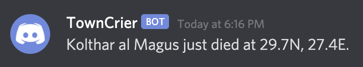

# TownCrier

A webhook plugin for Decal. Send ingame events (such as dying) to a webhook (such as a Discord channel). TownCrier can also send webhooks on timed intervals (e.g., sending your unassigned XP every hour).

## What is a webhook?

A webhook is a way for services to talk to one another.
This is done by one service sending an HTTP request of some sort to a receiver and the receiver then does _something_ with it.
A familiar example is hooking up a Discord channel to a service like GitHub/GitLab.

## Installation

Until I release the first version, you'll have to build and install the plugin manually.

- Build the plugin (or ask me on [Discord](https://discord.gg/6hUvBrx))
- Open Decal
- Click Add (updating if it asks you)
- Click Browse
- Find TownCrier.dll and click Save

## Getting started

To get started, you need to:

1. Create at least one Webhook
2. Create at least one Trigger (Event, Timed, or Chat)

### Creating a webhook

This guide assumes you're at least somewhat familiar with webhooks or at least the technology involved.

**Note: The URL and Payload fields are templates and use a wildcard (an `@`) to fill in the appropriate message so make sure you have an `@` where your message should go.**

1. Provide a name for your webhook. It must be unique.
2. Provide a URL for your webhook

	Some webhook providers use query parameters (http://example.com/?foo=bar) instead of JSON payloads to send webhook parameters.
	For these cases, put an `@` symbol in the URL where your message should go.
	For example, a webhook for Zapier can look like `https://hooks.zapier.com/hooks/catch/123456/abcdefg/?message=@`, note the `@`.
	If the ingame message is "You died.", TownCrier would replace that `@` with "You died." and send a GET request to `https://hooks.zapier.com/hooks/catch/123456/abcdefg/?message=You%20died`.

3. Provide an HTTP method (GET or POST) for your webhook
4. Optional. Provide a JSON payload (only for POST webhooks). There's no need to fill this in for GET webhooks.

	Similar to how the `@` gets used in the URL for GET webhooks, enter a JSON template with an `@` where your message should go.
	For example, a Discord webhook payload would could like `{"content": "@"}` and the `@` would get replaced by the ingame message.
5. Click Add Webhook

### Creating Trigger

Triggers cause Webhooks to be sent.
There are three types of Triggers:

1. Event: Send Webhooks when certain events happen ingame (e.g., you dying)
2. Timer: Send Webhooks at timed intervals
3. Chat: Send Webhooks when you see certain text in chat (doesn't have to be actual chat, just messages in the chat window)

The trickiest part of setting up a trigger is using the Message field.

In the Message field, you can make use of special variables to send yourself information about your character. You can use as many variables as you want in each Message and each variable starts with a '$' (e.g., $LOC gives your coordinates).

Available variables are $NAME, $LEVEL, $UXP (unassigned xp), $TXP (total XP), $HEALTH, $STAMINA, $MANA, $VITAE, and $LOC (Your location). Example: 'Hello, $NAME' would print 'Hello, ' followed by your character's name.

Event and Chat Triggers can also make use of a special variable, $EVENT, that lets you print the text of the event or chat message that triggered the webhook. For example, a Chat trigger with the Pattern 'You say' and a Message of '$EVENT' will send everything you say to your webhook. $EVENT does not work for TimedTriggers.
            